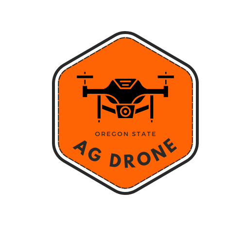

# Ag Drone Project
An open source agricultural drone built by students at Oregon State University

## How to Turn the Drone On
### First Time Startup
1. Setup the [Raspberry Pi Tablet](documentation/rasp_pi_setup.md)
2. Have your drone completely wired, connected, and setup.
   - We have a [parts list](documentation/parts_list.md) for the version we used for testing and prototyping.
3. If you are using a Transmitter controller, ensure it is connected according to the manufacturers instructions.
4. Copy and paste this command in the terminal to install the AgDrone software auto-magically
   - curl https://raw.githubusercontent.com/AgDrone/AgDroneGUI/main/install.sh | bash

### General Startup
1. Plug in your drone batteries

## Troubleshooting
### Basic Troubleshooting
1. Once the drone has been safely landed and disarmed, unplug and replug the batteries. Trust me, this can fix most problems with electronics.

### Advanced Issues and Troubleshooting
If you are having issues that aren't listed or addressed above...
1. Check out the [documentation files](documentation/doc_directory.md)
2. Feel free to reach out to any of the recent Github project maintainers
